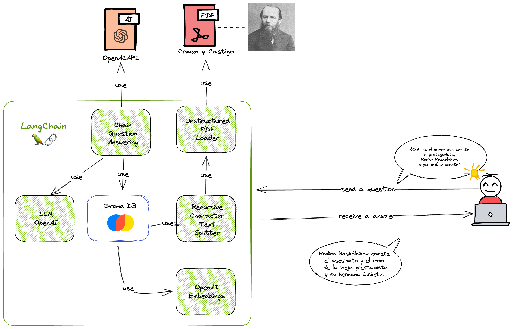

# Langchain y Crimen y Castigo

El objetivo de este proyecto es crear un notebook que permita realizar preguntas
en lenguaje natural al libro [Crimen y Castigo de Dostoievski](https://www.elejandria.com/libro/crimen-y-castigo/dostoyevski-fiodor/146)

Es importante destacar que **NO** estamos realizando un búsqueda "clásica" dentro del libro, sino que estamos usando como contexto para GPT la base de datos de Chroma que contiene multiples fragmentos del libro almacenados en forma de vectores.

Ahora podemos hablar con un libro, y que el libro nos conteste.

¡Se acabaron los deberes escolares!

## Ejemplo

A la pregunta:

> ¿Cuál es el crimen que comete el protagonista, Rodion Raskólnikov, y por qué lo comete?

La respuesta sería:

> Rodion Raskólnikov comete el asesinato y el robo de la vieja prestamista y su hermana Lisbeth. Lo comete por la miseria y el deseo de abrirse paso en la vida con los tres mil rublos que esperaba encontrar en casa de la víctima.

## ¿Cómo funciona?

Con la ayuda de la base de datos [Chroma](https://www.trychroma.com/), la [API de OpenAI](https://openai.com/) y [Langchain](https://langchain.readthedocs.io/) como conector entre ambas, el notebook es capaz de entender las preguntas del usuario y responder de forma precisa y coherente.

## Precio

[La API de OpenAI es de pago](https://openai.com/pricing). Existen múltiples modelos, cada uno con diferentes capacidades y precios.
Los precios son por 1.000 tokens. Puedes pensar en los tokens como piezas de palabras, donde 1000 tokens equivalen a unas 750 palabras.

Depende de la cantidad de tokens que se utilicen para generar el texto y del modelo utilizado, el precio ronda los 0.0005 dólares por cada mil tokens. En este proyecto he gastado 0.62 dólares.

## ¿Qué es Chroma?

Es una base de datos de tipo embedding, capaz de almacenar datos en forma de vectores de alta dimensionalidad, también conocidos como "embeddings".

En una base de datos de tipo embedding, cada objeto, como una palabra, una imagen o un documento, se representa como un vector en un espacio vectorial de alta dimensión. Esta representación vectorial se crea utilizando técnicas de aprendizaje automático, como la reducción de dimensionalidad o la descomposición en valores singulares (SVD), y tiene como objetivo capturar la información esencial del objeto.

Una de las ventajas de utilizar una base de datos de tipo embedding es que permite la búsqueda y recuperación de información de manera más eficiente que las bases de datos tradicionales. Por ejemplo, en una base de datos de imágenes, una consulta de búsqueda puede ser realizada utilizando una imagen como entrada, y la base de datos devuelve todas las imágenes similares a la imagen de entrada, basándose en la similitud de sus vectores de embedding.

Las bases de datos de tipo embedding se utilizan comúnmente en aplicaciones de procesamiento de lenguaje natural (NLP), visión por computadora y recomendación de contenido personalizado.

## ¿Qué es la API de OpenAI?

Es una API que permite interactuar con el modelo de lenguaje GPT-3, el cual es capaz de generar texto en base a un contexto.

## ¿Que es Langchain?

Es una librería de Python que permite (entre otras muchas cosas) conectar una base de datos de tipo embedding con modelos de lenguaje como GPT-3 (en este caso, la API de OpenAI).

## Preguntas sobre la novela Crimen y Castigo

- ¿Cuál es el crimen que comete el protagonista, Rodion Raskólnikov, y por qué lo comete?
- ¿Qué papel juega Sonia Marmeládova en la historia y cómo influye en la evolución del personaje principal?
- ¿Cómo se relaciona el tema de la culpa con la trama de la novela?
- ¿Qué críticas sociales hace Dostoyevski a través de la historia?
- ¿Qué simboliza el personaje del inspector Porfirio Petrovich?
- ¿Cómo evoluciona el personaje de Raskólnikov a lo largo de la novela?
- ¿Cómo se relaciona la teoría del "hombre extraordinario" de Raskólnikov con el contexto histórico en que fue escrita la novela?
- ¿Qué papel juega el ambiente opresivo y sombrío de San Petersburgo en la trama?
- ¿Cómo se relaciona la estructura de la novela con su contenido y temática?
- ¿Qué enseñanza moral podemos extraer de la novela "Crimen y Castigo"?
